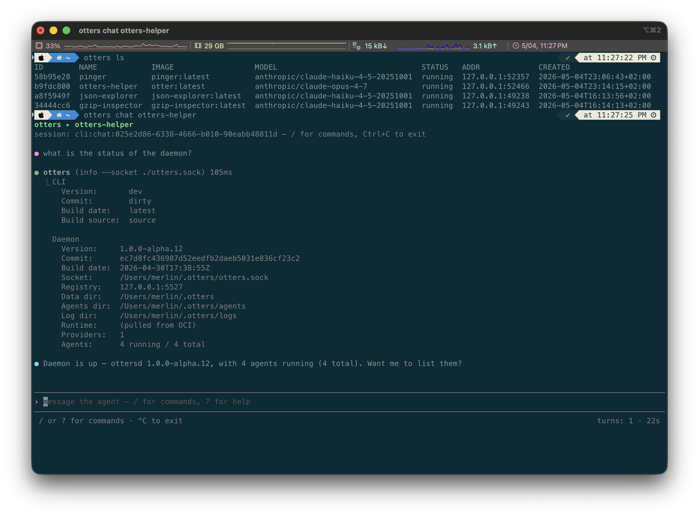
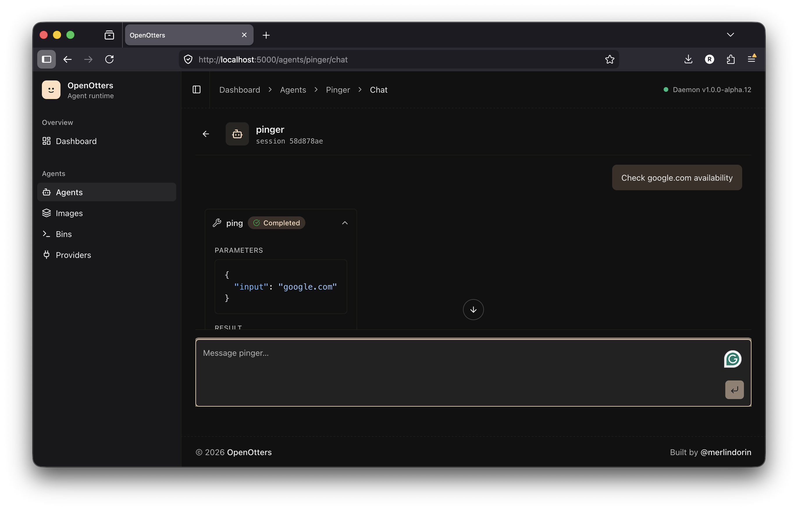
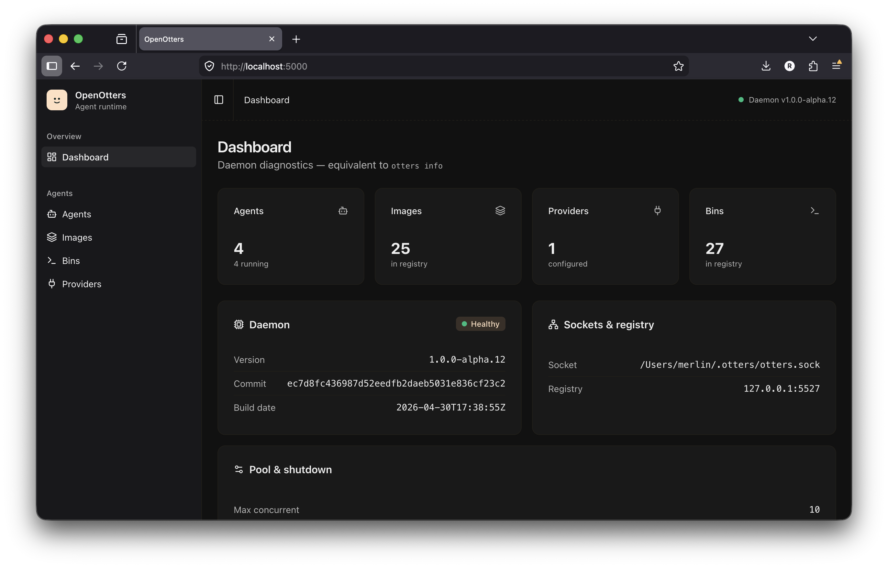
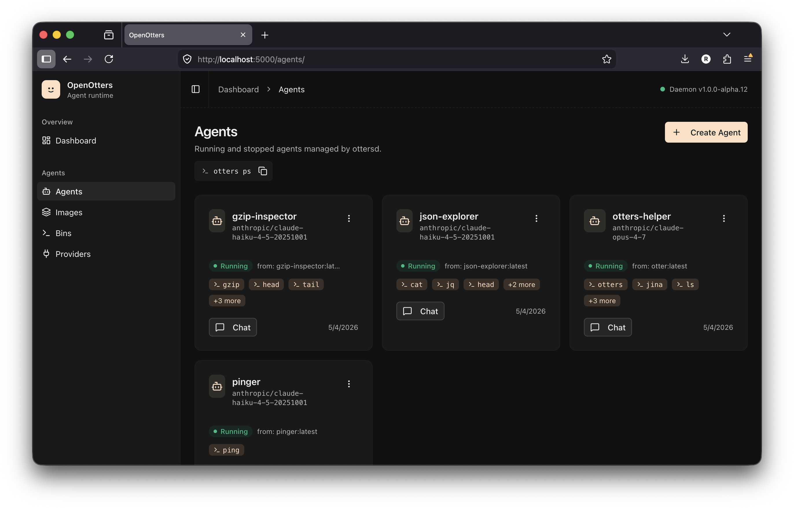
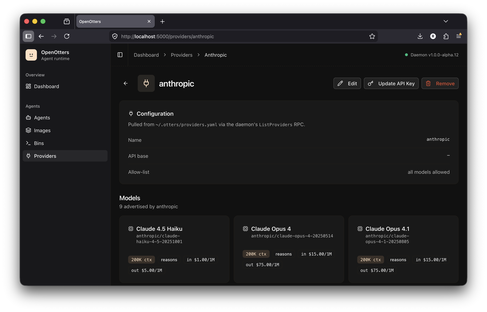

<div align="center">

# 🦦 OpenOtters

**Declarative AI agents — like Docker, but for autonomous agents.**

**[openotters.io →](https://openotters.io)**

[](https://pkg.go.dev/github.com/openotters/openotters)
[](https://goreportcard.com/report/github.com/openotters/openotters)
[](LICENSE.md)
[](#)
[](https://openotters.io)

<a href="https://asciinema.org/a/1011975"></a>

</div>

You write an [Agentfile](https://github.com/openotters/agentfile), build it into an OCI image, and
run it. Runtime, tools, memory, sessions, and persistence are handled for you. **No code. No SDK.**

> ⚠️ Early alpha — APIs and on-disk state can change without notice.

## Contents

- [Get started](#get-started)
- [Quickstart](#quickstart)
- [Demo agents](#demo-agents)
- [Build your own agent](#build-your-own-agent)
- [CLI cheat sheet](#cli-cheat-sheet)
- [Gallery](#gallery)
- [Roadmap](#roadmap)
- [License](#license)

## Get started

```sh
brew install openotters/tap/otters
brew services start otters
```

Or with Go:

```sh
go install github.com/openotters/openotters/cmd/otters@latest
go install github.com/openotters/openotters/cmd/ottersd@latest
ottersd serve &
```

## Quickstart

```sh
otters provider add                                       # interactive: anthropic / openai / ollama / …
otters run ghcr.io/openotters/agents/pinger:latest --name pinger
otters chat pinger
```

```console
$ otters prompt pinger "google.com"
google.com: reachable
```

## Demo agents

Public images on GHCR — pull and run, no clone needed:

| Agent      | Image                                        | What it does                                          |
|------------|----------------------------------------------|-------------------------------------------------------|
| `pinger`   | `ghcr.io/openotters/agents/pinger:latest`    | TCP-port-80 reachability probe                        |
| `reader`   | `ghcr.io/openotters/agents/reader:latest`    | Fetch a URL via Jina Reader, summarise it             |
| `meteo`    | `ghcr.io/openotters/agents/meteo:latest`     | Weather lookup using Open-Meteo + jq                  |
| `greeting` | `ghcr.io/openotters/agents/greeting:latest`  | Warm replies returned as strict JSON                  |

```sh
otters run ghcr.io/openotters/agents/reader:latest --name reader
otters chat reader
```

🔎 **Browse the full registry → [github.com/orgs/openotters/packages](https://github.com/orgs/openotters/packages)**

## Build your own agent

```dockerfile
FROM scratch
RUNTIME ghcr.io/openotters/runtime:latest
MODEL anthropic/claude-haiku-4-5-20251001
NAME pinger

CONTEXT SOUL <<EOF
You are a connectivity probe. Given a host, call the ping tool
and reply "<host>: reachable" or "<host>: unreachable (<reason>)".
EOF

BIN ping ghcr.io/openotters/tools/ping:latest "TCP-port-80 reachability"
```

```sh
otters run ./Agentfile --name my-pinger
otters image push ghcr.io/me/my-pinger:v1
```

Full grammar reference: **[Agentfile spec →](https://github.com/openotters/agentfile)**

## CLI cheat sheet

```sh
otters run <ref> --name <name>           # build (if needed) + start
otters ls                                # list agents
otters chat | prompt <name>              # talk to an agent
otters stop | start | rm <name>          # lifecycle
otters logs <name>                       # tail runtime log
otters provider add | ls | rm            # LLM providers
otters image build | push | pull | ls    # agent images
otters bin ls                            # available BIN tools
otters info                              # daemon status
```

Run `otters <cmd> --help` for details.

## Gallery

<p align="center">
  
  
</p>
<p align="center"><sub>Same agent, two surfaces — terminal (left) and browser (right).</sub></p>

<p align="center">
  
  
  
</p>
<p align="center"><sub>Dashboard · Agents · Providers</sub></p>

## Roadmap

Heading toward **v1.0 GA**. Tracking issues / discussions live on
[GitHub](https://github.com/openotters/openotters/issues).

**Next**
- [ ] Stabilise the [Agentfile grammar](https://github.com/openotters/agentfile) (frozen at v1.0)
- [ ] Docker executor — run agents in containers, not just host processes
- [ ] Per-tool sandboxing — each BIN constrained independently
- [ ] First-class agent registry browsing (`otters search`, `otters image inspect <remote>`)

**Later**
- [ ] More LLM providers + a leaner Ollama path for local-only setups
- [ ] Multi-agent orchestration — agents calling agents as BINs
- [ ] Workspace mounts you can edit live from the GUI
- [ ] Hosted daemon for "agents anywhere" — same artifacts, no local install

**Done**
- ✅ Locked-down spawn env (no host secret leakage to agents)
- ✅ Auto-generated WORKSPACE.md + filesystem awareness in the system prompt
- ✅ Pluggable executor abstraction (`agent.Provider` is the seam)
- ✅ Provider config via `otters provider add` (interactive + scripted)
- ✅ Multi-session chat, log persistence, structured-output mode

## License

MIT — see [LICENSE.md](LICENSE.md).
